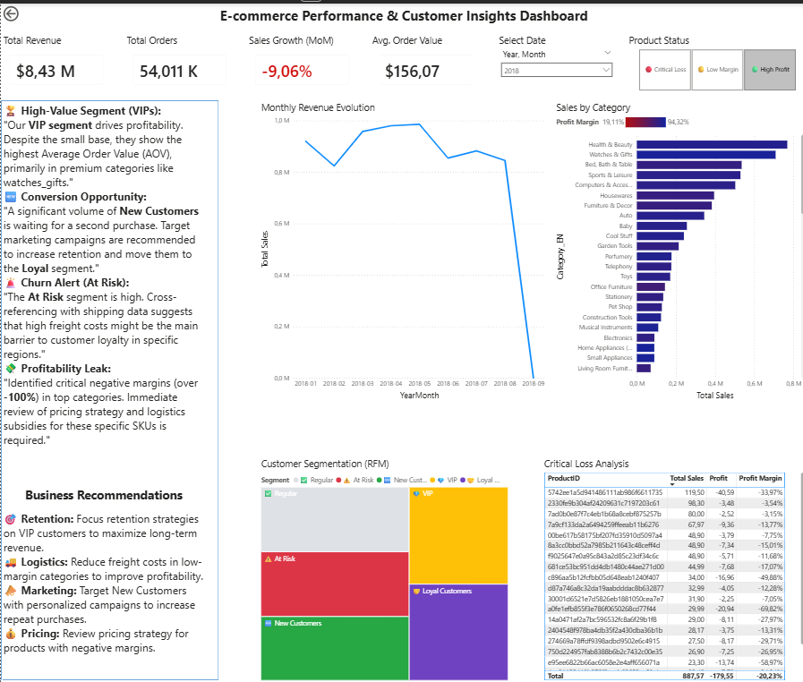

# E-commerce Performance & Customer Insights Dashboard

## 📌 Project Overview
This project provides a strategic executive view of the **Olist E-commerce dataset**. The analysis focuses on customer behavior, profitability, and sales performance to drive data-informed business decisions.

The core of the project is the **RFM Segmentation**, identifying high-value customers and churn risks, combined with a detailed analysis of product margins.

## 📊 Key Performance Indicators (KPIs)
- **Total Revenue:** $8.43M
- **Total Orders:** 54k
- **Sales Growth (MoM):** -9.06%
- **Average Order Value (AOV):** $156.07

## 🧠 Business Insights & Storytelling
- **High-Value Segment (VIPs):** Our VIP segment drives profitability. Despite the small base, they show the highest AOV, primarily in premium categories like *Watches & Gifts*.
- **Conversion Opportunity:** A significant volume of *New Customers* is waiting for a second purchase. Targeted marketing is required to move them to the *Loyal* segment.
- **Churn Alert (At Risk):** High freight costs in specific regions suggest a barrier to loyalty for the *At Risk* group.
- **Profitability Leak:** Identified critical negative margins in top categories, requiring immediate pricing and logistics review.

## 🛠️ Strategic Recommendations
- **🎯 Retention:** Focus retention strategies on **VIP customers** to maximize long-term revenue (LTV).
- **🚚 Logistics:** Reduce freight costs in **low-margin categories** to improve overall profitability.
- **📣 Marketing:** Target **New Customers** with personalized campaigns to increase repeat purchases.
- **💰 Pricing:** Immediate review of pricing strategy for **products with negative margins**.

## 🔧 Tech Stack
- **Power BI Desktop:** Dashboard design and data storytelling.
- **DAX (Data Analysis Expressions):** Complex measures for MoM Growth and RFM logic.
- **Power Query (M):** Data cleaning, ETL, and category translation (Portuguese to English).
- **Mobile Optimization:** Dedicated layout for executive on-the-go viewing.

## 📂 Data Source
The dataset used in this project is the **Brazilian E-Commerce Public Dataset by Olist**, available on Kaggle. It contains information on 100k orders from 2016 to 2018 made at multiple marketplaces in Brazil.

👉 [Access the original dataset here](https://www.kaggle.com/datasets/olistbr/brazilian-ecommerce)

---
## 🚀 How to view the project
1. Download the `Customer_RFM_Analysis.pbix` file.
2. Open it using **Power BI Desktop**.
3. Explore the interactive filters (Date, Product Status) to see the insights in action.